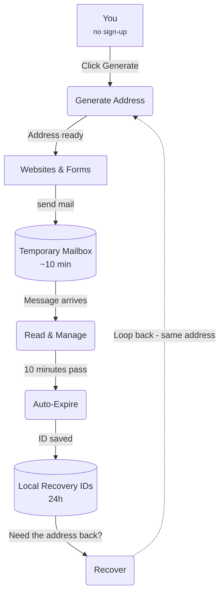

# 📧 FluxMail - Temporary Mail Service

Disposable email addresses with a built-in inbox and email recovery. No account, no personal data — messages and addresses expire automatically.

## Features

- **10-minute temporary addresses** — generate instantly, no sign-up
- **Built-in inbox** — auto-refreshes, read/delete messages
- **Attachments supported**
- **Email recovery** — a unique ID restores the same address for another 10 minutes (record kept in your browser for 24 hours)
- **Privacy first** — no registration, honest about data: mail isn't deleted instantly and stays recoverable for a limited time
- **Responsive** — works on any device

## How It Works



## Quick Start

```bash
npm install
npm run dev       # start the dev server
npm run build     # production build
npm run lint      # lint
npm run preview   # preview the production build
```

## Recovery

Each generated address gets a `FLUX-XXXX-XXXX` recovery ID. When the active window expires, enter the ID in the **Recover Expired Mailbox** section to bring the same address back. Recovery works while the provider still holds the address — usually about an hour after expiry.